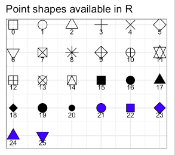
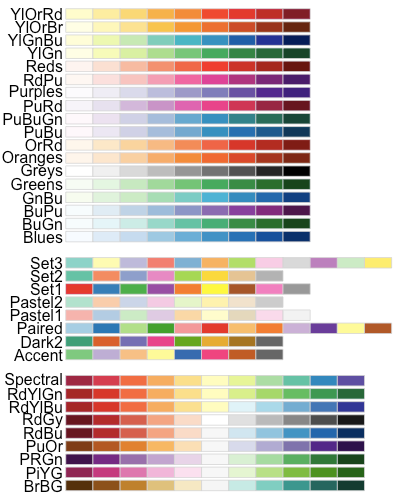

<style type="text/css">
div.blue { background-color:#e6f0ff; border-radius: 5px; padding: 20px;}
div.orange { background-color:#ffa366; border-radius: 5px; padding: 20px;}
div.yellow { background-color:#09bb9f; color: white; border-radius: 5px; padding: 20px;}
</style>

<meta name="decsription" content="Find useful online applications to make correlation tables, moderation or interaction plots and many more." />

<!-- Global site tag (gtag.js) - Google Analytics -->
<script async src="https://www.googletagmanager.com/gtag/js?id=UA-120279443-3"></script>
<script>
  window.dataLayer = window.dataLayer || [];
  function gtag(){dataLayer.push(arguments);}
  gtag('js', new Date());

  gtag('config', 'UA-120279443-3');
</script>

<script type="text/javascript">

    $(document).ready(function() {
        document.title = 'Rcoding';
    });

</script>

<style>
.main-container {
  background-color:#d1d9e0;
  max-width: 1100px;
  margin-left: auto;
  margin-right: auto;
}
</style>

# Multidimensional Scaling
```{r, echo=FALSE,message=FALSE,warning=FALSE,}

data <- foreign::read.spss("SAQ_ouders_DATA_alleouderssamen.sav", 
                  use.value.labels = FALSE, 
                  to.data.frame=TRUE)

data <- data[,c('s1as_a','s1ch_b','s1str_v','s1con_d','s2ch_a','s2as_p','s2con_e','s2str1_v','s2as_a','s2str2_v','s3con_d',
               's3as1_a','s3ch_b','s3as_p','s3con_e','s3str_v','s3ch_a','s3as2_a','s4str_v','s4con_d','s4ch_b','s4as_a','s4con_e','s5ch_b',
               's5as_a','s5con_d','s5ch_a','s5str_v','s5con_e','s6as1_a','s6ch_a','s6con1_e','s6as_p','s6str_v','s6con2_e','s6str_b',
               's6as2_a','s7str_v','s7as_a','s7ch_a','s7con_d','s8as_p','s8ch_b','s8str_v','s8con_d','s8as_a','s9con_d','s9ch_b','s9as_a',
               's9con_e','s9str_v','s10str_b','s10as_a','s10con_d','s10ch_a','s11str1_b','s11ch_b','s11str2_b','s11as1_a','s11con_e',
               's11as2_a','s12con_e','s12ch_b','s12str_v','s12as_a','s12con_d','s13as_a','s13ch1_b','s13con_e','s13as_p','s13str_b',
               's13ch2_b','s13con_d','s14ch_a','s14con_d','s14str_b','s14as_a','s15as_p','s15ch_a','s15con_e','s15str_b','s16con1_e',
               's16ch_b','s16as1_a','s16con_d','s16str_b','s16as2_a','s16con2_e','s17str_v','s17as_p','s17ch_a','s17con_e','s18ch_b',
               's18as_a','s18str_b','s18con_d')]
colnames(data) <- c("item1",
"item2",
"item3",
"item4",
"item5",
"item6",
"item7",
"item8",
"item9",
"item10",
"item11",
"item12",
"item13",
"item14",
"item15",
"item16",
"item17",
"item18",
"item19",
"item20",
"item21",
"item22",
"item23",
"item24",
"item25",
"item26",
"item27",
"item28",
"item29",
"item30",
"item31",
"item32",
"item33",
"item34",
"item35",
"item36",
"item37",
"item38",
"item39",
"item40",
"item41",
"item42",
"item43",
"item44",
"item45",
"item46",
"item47",
"item48",
"item49",
"item50",
"item51",
"item52",
"item53",
"item54",
"item55",
"item56",
"item57",
"item58",
"item59",
"item60",
"item61",
"item62",
"item63",
"item64",
"item65",
"item66",
"item67",
"item68",
"item69",
"item70",
"item71",
"item72",
"item73",
"item74",
"item75",
"item76",
"item77",
"item78",
"item79",
"item80",
"item81",
"item82",
"item83",
"item84",
"item85",
"item86",
"item87",
"item88",
"item89",
"item90",
"item91",
"item92",
"item93",
"item94",
"item95",
"item96")
```

Welcome to the R coding for Multidimensional Scaling.  
<br>
For this code, we will use the package [`smacof`](https://CRAN.R-project.org/package=smacof) (De Leeuw & Mair, 2009). *Multidimensional scaling* (MDS) is a family of scaling methods for discovering structures in multidimensional scaling. In this R code, we provide an overview of the most applicable codes to use for both analysis as for visualisation (like a two-dimensional graphical representation reflecting the map, see Kruskal & Wish, 1978).
<br>

## The dataset and scaling
To start, select your columns from your dataset and save them in the subset *MDselected*.  
Important, these columns have to be standardized. In doing so, save the **standardized** dataset in the subset *MDS*. This will be the dataset to use in the further analyses.  
To check, ask a summary of your dataset to **check** whether the means are 0 (here, only the first 6 columns are shown). Use `summary(MDS)` to see the full dataset.

```{r, message=FALSE}
# select your variables
MDSselected <- data[,c(1:96)]

# scale your variables
MDS <- scale(MDSselected,scale=TRUE)

summary(MDS[,c(1:6)])
```

## Dissimilarity matrix

To make the input of the MDS, a **dissimilarity matrix** is made based on the *Euclidean* distances. 

```{r, message=FALSE}
# load packages
# to install, use install.packages('MASS')
library(MASS)
library(stats)
library(smacof)

# calculate dissimilarity matrice based on Euclidean space
distMDS <- dist(t(MDS))

# 
MDSresult <- mds(distMDS)
MDSresult
```

## Scaling the dissimilarities

An important MDS issue in practice concerns **the scale level** we want to assign to the dissimilarities.  

- The interval scale level: a linear transformation where the ratio of differences of
distances should be equal to the corresponding ratio of differences in the data;  
- The ordinal scale level: the most popular approach, especially in the Social Sciences, where transformations preserve the rank order of the dissimilarities;  
- The Spline scale level: an *I*-spline (integrated spline) transformation with fixed number of knots and spline degree.

```{r, message=FALSE, fig.height=8}

fit.interval <- mds(distMDS, type = "interval")
fit.ordinal1 <- mds(distMDS, type = "ordinal", ties = "primary")
fit.ordinal2 <- mds(distMDS, type = "ordinal", ties = "secondary")
fit.spline   <- mds(distMDS, type = "mspline", spline.intKnots = 3,spline.degree = 2)
```

These transformations can be nicely shown in **a Shepard diagram** (a scatterplot between the dissimilarities and the configuration distances).

```{r, message=FALSE, fig.height=8}
op <- par(mfrow = c(2,2))

p1 <- plot(fit.interval, plot.type = "Shepard",
      main = "Shepard Diagram (Interval MDS)", ylim = c(0.1, 1.7))

p2 <- plot(fit.ordinal1, plot.type = "Shepard",
      main = "Shepard Diagram (Ordinal MDS, Primary)", ylim = c(0.1, 1.7))

p3 <- plot(fit.ordinal2, plot.type = "Shepard",
      main = "Shepard Diagram (Ordinal MDS, Secondary)", ylim = c(0.1, 1.7))

p4 <- plot(fit.spline, plot.type = "Shepard",
      main = "Shepard Diagram (Spline MDS)", ylim = c(0.1, 1.7))

```

Plot the **disparities** distances against the fitted distances.

```{r, message=FALSE, fig.height=8}
op <- par(mfrow = c(2,2))

p1 <- plot(fit.interval, plot.type = "resplot",
      main = "Interval MDS")

p2 <- plot(fit.ordinal1, plot.type = "resplot",
      main = "Ordinal MDS, Primary")

p3 <- plot(fit.ordinal2, plot.type = "resplot",
      main = "Ordinal MDS, Secondary")

p4 <- plot(fit.spline, plot.type = "resplot",
       main =  "Spline MDS")
```

Plot the **stress contribution** in of each observation.  
The higher the contribution, the worse the fit.

```{r, message=FALSE, fig.height=8}
op <- par(mfrow = c(2,2))

p1 <- plot(fit.interval, plot.type = "stressplot",
      main = "Interval MDS")

p2 <- plot(fit.ordinal1, plot.type = "stressplot",
      main = "Ordinal MDS, Primary")

p3 <- plot(fit.ordinal2, plot.type = "stressplot",
      main = "Ordinal MDS, Secondary")

p4 <- plot(fit.spline, plot.type = "stressplot",
       main =  "Spline MDS")
```

The **2D map** of MDS configuration, plotted against the first two largest dimensions, is shown here:

```{r, message=FALSE, fig.height=8}
op <- par(mfrow = c(2,2))

p1 <- plot(fit.interval, plot.type = "confplot",
      main = "Interval MDS")

p2 <- plot(fit.ordinal1, plot.type = "confplot",
      main = "Ordinal MDS, Primary")

p3 <- plot(fit.ordinal2, plot.type = "confplot",
      main = "Ordinal MDS, Secondary")

p4 <- plot(fit.spline, plot.type = "confplot",
       main =  "Spline MDS")

```

## Linear restrictions

The **confirmatory MDS** refers to an external constraint on the configuration matrix. For instance, there could be a substantive underlying theory regarding a decomposition of the dissimilarities, like a circle. 

```{r, message=FALSE, fig.height=5}
fit.basic <- mds(distMDS, type = "ordinal")
fit.basic

fit.circ <- smacofSphere(distMDS, type = "ordinal", verbose = FALSE)
fit.circ
```

By looking at the stress values we see that the restricted solution (stress-1: 0.212) is not
much worse than the unrestricted solution (stress-1: 0.19).

```{r, message=FALSE, fig.height=5}
op <- par(mfrow = c(1,2))

plot(fit.basic,main="unrestricted MDS")

plot(fit.circ, main="restricted MDS")
```

## Setting for 2D plot

First, we extract the coordinates of the columns of our 2D MDS configuration plot.  
Next, we add a variable *Names* to this subset including the names to which the item initially belongs. 

```{r, message=FALSE}
coord <- as.data.frame((fit.ordinal1$conf)*-1) # parameter *-1 added to change direction of dimensions

# If only one dimension has to shift horizontally:
# coord$D1 <- (coord$D1)*-1

coord$items <- rownames(coord)

coord$Names <- c('group1','group2','group3','group4','group2','group1','group4','group3','group1','group3','group4','group1','group2','group1','group4','group3','group2','group1','group3','group4','group2','group1','group4','group2','group1','group4','group2','group3','group4','group1','group2','group4','group1','group3','group4','group3','group1','group3','group1','group2','group4','group1','group2','group3','group4','group1','group4','group2','group1','group4','group3','group3','group1','group4','group2','group3','group2','group3','group1','group4','group1','group4','group2','group3','group1','group4','group1','group2','group4','group1','group3','group2','group4','group2','group4','group3','group1','group1','group2','group4','group3','group4','group2','group1','group4','group3','group1','group4','group3','group1','group2','group4','group2','group1','group3','group4')

head(coord)
```

Different settings are possible.

```{r, message=FALSE}
library(dplyr)
library(ggplot2)
library(ggalt)
library(ggforce)

# basis plot
p <- ggplot(coord, aes(x=D1, y=D2)) +
  geom_point(size=3)+
  theme_classic()+
  ylim(-1,1)

p

# add color and shape for levels of the variable Names
p0 <- ggplot(coord, aes(x=D1, y=D2, color=Names,shape=Names)) +
  geom_point(size=3)+
  theme_classic()+
  ylim(-1,1)

p0

# add more than 6 shapes
p1 <- ggplot(coord, aes(x=D1, y=D2, color=Names,shape=Names)) +
  geom_point(size=3)+
  scale_shape_manual(values=1:nlevels(as.factor(coord$Names)))+
  theme_classic()+
  ylim(-1,1)

p1

# specify the shapes by yourself
p2 <- ggplot(coord, aes(x=D1, y=D2, color=Names,shape=Names)) +
  geom_point(size=3)+
  scale_shape_manual(values=c(0,15,21,25))+
  theme_classic()+
  ylim(-1,1)

p2

```

The different shapes are:

<center>

</center>


```{r, message=FALSE}

# add regions
p3 <- p2 + ggforce::geom_mark_hull(aes(color=Names, fill = Names),
                          concavity = 5, 
                          expand=0, 
                          radius=0)

p3

# add labels to the regions
p4 <- p2 + ggforce::geom_mark_hull(aes(label = Names, color = Names,fill=Names),
                          concavity = 5, 
                          expand=0, 
                          radius=0)

p4

# add labels of items
p5 <- p3 + geom_text(aes(label=items), hjust=0, vjust=0)

p5

# add black labels of items
p6 <- p3 + geom_text(aes(label=items), hjust=0, vjust=0, color='black')

p6

# change colors by your own preference
p7 <- p3 + scale_color_manual(values=c("grey", "red", "#9633FF", "#E2FF33"))+
           scale_fill_manual(values=c("grey", "red", "#9633FF", "#E2FF33"))

p7

# use ggplot color pallets. 
p8 <- p3 + scale_color_brewer(palette="Dark2") +
           scale_fill_brewer(palette="Dark2")

p8
```

The different pallets are:

<center>

</center>


```{r, message=FALSE}
# use ggplot color pallets in black and white
p9 <- p3 + scale_color_grey(start = 0.8, end = 0.2)+
           scale_fill_grey(start = 0.8, end = 0.2) 

p9
```


***

&nbsp;
<hr />
<p style="text-align: center;">A work by <a href="www.ugent.be/epg/coronastudie">Joachim Waterschoot</a></p>
<p style="text-align: center;"><span style="color: #808080;"><em>Joachim.Waterschoot@ugent.be</em></span></p>

<!-- Add icon library -->
<link rel="stylesheet" href="https://cdnjs.cloudflare.com/ajax/libs/font-awesome/4.7.0/css/font-awesome.min.css">

<!-- Add font awesome icons -->
<p style="text-align: center;">
    <a href="https://twitter.com/watjoa" class="fa fa-twitter"></a>
    <a href="https://www.linkedin.com/in/watjoa/" class="fa fa-linkedin"></a>
    <a href="https://github.com/watjoa/" class="fa fa-github"></a>
</p>

&nbsp;


