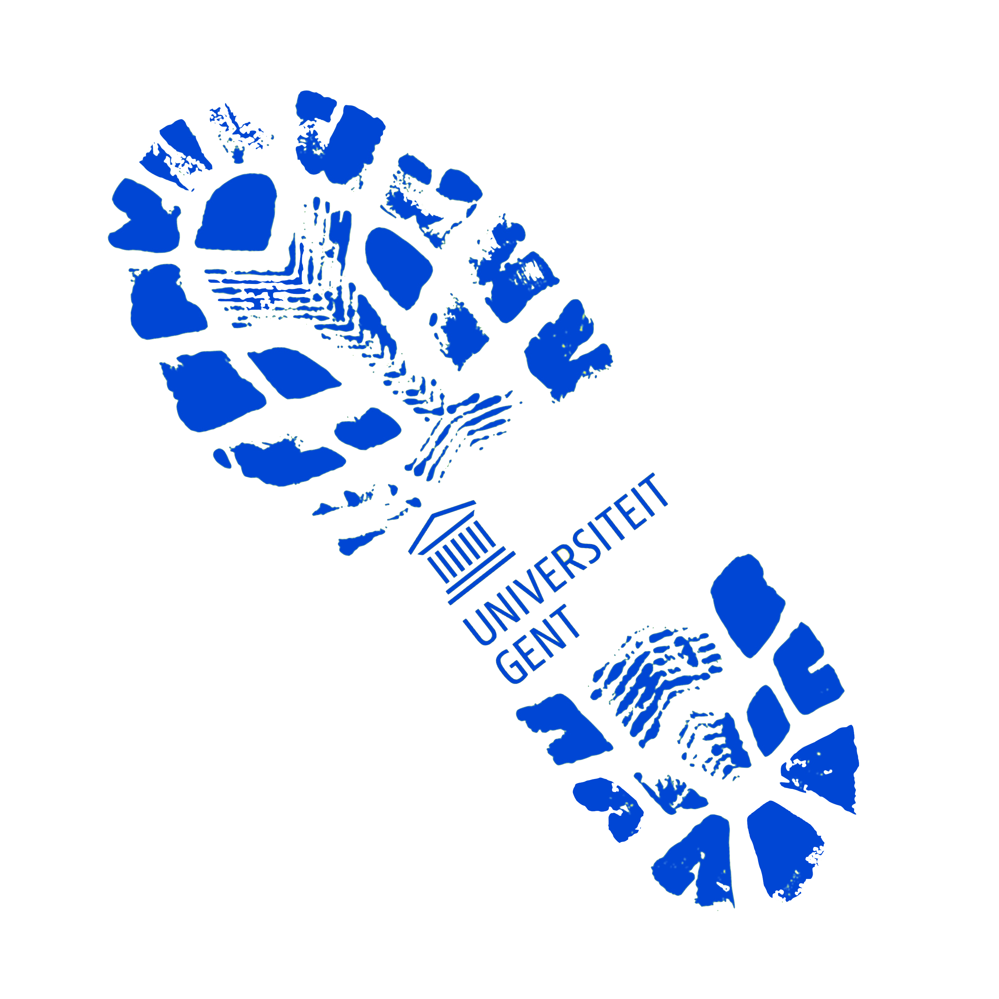

<style>
/* Whole document: */
body{
  font-size: 12pt;
  font-color: black;
}
div.blue { background-color:#e6f0ff; border-radius: 5px; padding: 20px;}
div.orange { background-color:#ffa366; border-radius: 5px; padding: 20px;}
div.appleblue { background-color:#09bb9f; color: white; border-radius: 5px; padding: 20px;}
p.comment {
background-color: #DBDBDB;
padding: 10px;
border: 1px solid black;
margin-left: 25px;
border-radius: 5px;
font-style: italic;
text-align: center;
}
</style>

<script>
   $(document).ready(function() {
     $head = $('#header');
     $head.prepend('')
   });
</script>

> "'I do not believe elephants exist at all,' declared the sixth blind man. <br> 'I think we are the victims of a cruel joke.'" 


<div class = "row">
<div class = "col-md-4">

<p class="comment">
[**Open my cv in short**](download/cv-master/cv.html )
</p>
</div>
<div class = "col-md-8">
</div>
</div>


# Education <i class="fa fa-graduation-cap" aria-hidden="true"></i>
***

* *2017 - current:* **PhD researcher in Developmental and Motivational Psychology**, Ghent University Ghent, Belgium. 
  + Thesis: The capacity of self-motivation: A multi-method investigation of the components, benefits and antecedents of motivational crafting (Supervisors: Prof. Maarten Vansteenkiste and Prof. Bart Soenens)  
  
* *2017 - 2020:* **MSc in Statistical Data Analysis**, Ghent University Ghent, Belgium. 
  + Thesis: “It is not the quantity of motivation that matters”: a statistical comparison between Cluster analysis and Latent profile analysis (Supervisors: Prof. Jan De Neve and Prof. Wim Beyers)  
  

* *2015 - 2017:* **MSc in Experimental and Theoretical Psychology**, Ghent University Ghent, Belgium. 
  + Thesis: Effect of Experimentally Induced Choice on Motivation in Middle Childhood: The Moderating Role of Teacher and Student Characteristics (Supervisor: Prof. Bart Soenens)
  + Research internship: The Role of Competence-related Attentional Bias and Resilience in Restoring Thwarted Feelings of Competence at the Department of Developmental Psychology, Ghent University (Supervisor: Prof. Maarten Vansteenkiste)  


* *2012 - 2015:* **BSc in Psychology**, Ghent University Ghent, Belgium.   

# Research projects <i class="fa fa-flask" aria-hidden="true"></i>
***

## PhD: Motivational Self-Regulation in Boring activities

<div class = "blue">

<div class = "row">
<div class = "col-md-9">

UITLEG

</div>
<div class = "col-md-3">
```{r, echo=FALSE, out.width = "100%"}
library(png)
library(knitr)
# Small fig.width

```
<!--  -->
</div>
</div>
</div>

## Dodentocht

<div class = "blue">

<div class = "row">
<div class = "col-md-9">

During the 50th edition of the 100 km Dodentocht, Bornem, Belgium, a study was installed to measure how people's motivation would be modified across time. More than 1300 participants participated the study. They completed questionnaire before and after the tour online. During the your, 4 posts were constructed with a group of people supporting the study. 

At the beginning of March, 2020 (two weeks before the start of the COVID-19 crisis), a public evening was organized with approx. 150 participants. At that moment, the results were presented and people were thanked.

[**Go to the website**](https://www.ugent.be/dodentocht)

</div>
<div class = "col-md-3">
```{r, echo=FALSE, out.width = "100%"}
library(png)
library(knitr)
# Small fig.width

```
<!--  -->
</div>
</div>
</div>

## Motivation barometer

<div class = "blue">
<div class = "row">
<div class = "col-md-9">

During the COVID-19 crisis, we monitored the motivation to adhere the corona measures in the Belgian population. The project started on March 19, 2020 and lasted until (current). More than 300 000 people participated. In total, we published 34 reports dealing with specific themes of the crisis. The results were shared on the website and communicated to the policy.

[**Go to the website**](www.motivationbarometer.com)

</div>
<div class = "col-md-3">
```{r, echo=FALSE, out.width = "150%"}
library(png)
library(knitr)
# Small fig.width
include_graphics('Barometer_illustratie-mettekst-transparant.png')
```
<!--  -->
</div>
</div>
</div>

<br>

# Statistics and Coding <i class="fa fa-line-chart" aria-hidden="true"></i>
***

<div class = "blue">
<div class = "row">
<div class = "col-md-9">
dfdfdfddf
https://watjoa.shinyapps.io/CaviR/ 

Regression modelling: https://watjoa.shinyapps.io/CaviRmodels/ 
</div>
<div class = "col-md-3">
```{r, echo=FALSE, out.width = "150%"}
library(png)
library(knitr)
# Small fig.width
include_graphics('logo.png')
```
<!--  -->
</div>
</div>
</div>

# Scientific Curriculum  <i class="fa fa-clipboard" aria-hidden="true"></i>
***

## Publications

### 2021

* Morbée, S., Vermote, B., Waterschoot, J., Dieleman, L., Soenens, B., Van den Bergh, O., Ryan, R. M., Vanhalst, J., De Muynck, G-J., & Vansteenkiste, M. (accepted). **Adherence to Covid-19 Measures: The Critical Role of Voluntary Motivation on a Short- and Long-Term Basis.** 

* Morbée, J., Haerens, L., Waterschoot, J., & Vansteenkiste, M. (2021). **Which Cyclists Manage to Cope with the Corona Crisis in a Resilient Way? The Role of Motivational Profiles.** *International Journal of Sport and Exercise Psychology* DOI: https://doi.org/10.1080/1612197X.2021.1940241 [Download <i class="fa fa-file-pdf-o" aria-hidden="true"></i>](download/sciencs/studies/sUc8WN-Which cyclists manage to cope with the corona crisis in a resilient way The role of motivational profiles.pdf)

* Schrooyen, C., Soenens, B., Waterschoot, J., Vermote, B., Morbée, S., Beyers, W., Brenning, K., Dieleman, L., Van der Kaap-Deeder, J., & Vansteenkiste, M. (2021). **Parental identity as a resource for parental adaptation during the COVID-19 lockdown** *Journal of Family Psychology* DOI: 10.1037/fam0000895 [Download <i class="fa fa-file-pdf-o" aria-hidden="true"></i>](download/sciencs/studies/2021-65223-001.pdf)

* *Waterschoot. J.*, Van der Kaap-Deeder, J., Morbée, S., Soenens, B., & Vansteenkiste, M. (2021). **'How to Unlock Myself from Boredom?' The Role of Mindfulness and a dual Awareness- and Action-Oriented Pathway during the COVID-19 Lockdown.** *Personality and Individual Differences, 175*, 110729.DOI: https://doi.org/10.1016/j.paid.2021.110729 [Download <i class="fa fa-file-pdf-o" aria-hidden="true"></i>](download/sciencs/studies/1-s2.0-S0191886921001045-main.pdf)

* Van der Kaap-Deeder, J., Vermote, B., Waterschoot, J., Soenens, B., Morbee, S., & Vansteenkiste, M. (2021). **The Role of Ego Integrity and Despair in Older Adults’ Well-being during the Covid-19 Crisis: The Mediating Role of Need-based Experiences.** *European Journal of Ageing* [Download <i class="fa fa-file-pdf-o" aria-hidden="true"></i>](download/sciencs/studies/VanDerKaap-Deeder2021_Article_TheRoleOfEgoIntegrityAndDespai.pdf)

* Vermote, B., *Waterschoot. J.*, Morbée, S., Van der Kaap-Deeder, J., Schrooyen, C., Soenens, B., Ryan, R., & Vansteenkiste, M. (2021). **Do psychological needs play a role in times of uncertainty? Associations with well-being during the corona crisis.** *Journal of Happiness Studies* https://doi.org/10.1007/s10902-021-00398-x [Download <i class="fa fa-file-pdf-o" aria-hidden="true"></i>](download/sciencs/studies/Vermote_et_al-2021-Journal_of_Happiness_Studies.pdf)

### 2020
  
* Waterschoot, J., Van der Kaap-Deeder, J., & Vansteenkiste, M. (2020). **The Role of Competence-related Attentional Bias and Resilience in Restoring Thwarted Feelings of Competence.** *Motivation and Emotion. Special issue: Advancing the Field of Basic Psychological Needs, 44*(1), 82-98. DOI: https://doi.org/10.1007/s11031-019-09776-8 [Download <i class="fa fa-file-pdf-o" aria-hidden="true"></i>](download/sciencs/studies/Waterschoot2020_Article_TheRoleOfCompetence-relatedAtt.pdf)

### 2019   

* De Muynck, G., Soenens, B., Waterschoot, J., Degrauewe, L., Vande Broek, G., & Vansteenkiste, M. (2019). **Towards a More Refined Insight in the Critical Motivating Features of Choice: An Experimental Study among Recreational Rope Skippers.** *Journal of Psychology of Sport & Exercise, 45*, 101561. DOI: https://doi.org/10.1016/j.psychsport.2019.101561 [Download <i class="fa fa-file-pdf-o" aria-hidden="true"></i>](download/sciencs/studies/1-s2.0-S1469029218304990-main.pdf)  

* Waterschoot, J., Vansteenkiste, M. & Soenens, B. (2019). **The Effects of Experimentally Induced Choice on Elementary School Children’s Intrinsic Motivation: The Moderating Role of Indecisiveness and Teacher-Student Relatedness.** *Journal of Experimentally Child Psychology, 188*. DOI: https://doi.org/10.1016/j.jecp.2019.104692 [Download <i class="fa fa-file-pdf-o" aria-hidden="true"></i>](download/sciencs/studies/1-s2.0-S0022096519301110-main.pdf)

## Chapters

* Vansteenkiste, M., Soenens, B., & Waterschoot, J. (in press). Catalyzing Intrinsic and Internalized Motivation: The Role of Basic Psychological Needs and their Support. In A. O'Donnell, N. C. Barnes, & J. Reeve (Eds.), **Oxford Handbook of Educational Psychology** (pp. XX-XX). Oxford University Press.

## Public reports

### 2021

* Motivation Barometer (September 9, 2021). **Is there still motivational support for the measures in various regions?** (Report No. 34). Ghent & Louvain, Belgium. [NL](download/reports/Dutch/RAPPORT 34.pdf) / 
[FR](download/reports/French/RAPPORT 34_FR.pdf) / 
[ENG](download/reports/English/RAPPORT 34_ENG.pdf) 

* Motivation Barometer (August 17, 2021). **Update on vaccination, motivation and mental health during a transition phase.** (Report No. 33). Ghent & Louvain, Belgium. [NL](download/reports/Dutch/RAPPORT 33.pdf) / 
[FR](download/reports/French/RAPPORT 33_FR.pdf) / 
[ENG](download/reports/English/RAPPORT 33_ENG.pdf) 

* Motivation Barometer (July 14, 2021). **Obliging health professionals to be vaccinated: a good idea?** (Report No. 32). Ghent & Louvain, Belgium. [NL](download/reports/Dutch/RAPPORT 32.pdf) / 
[FR](download/reports/French/RAPPORT 32_FR.pdf) / 
[ENG](download/reports/English/RAPPORT 32_ENG.pdf) 

* Motivation Barometer (June 23, 2021). **Seduce, persuade and/or inform? How to deal with vaccine doubters?** (Report No. 31). Ghent & Louvain, Belgium. [NL](download/reports/Dutch/RAPPORT 31.pdf) / 
[FR](download/reports/French/RAPPORT 31_FR.pdf) / 
[ENG](download/reports/English/RAPPORT 31_ENG.pdf) 

* Motivation Barometer (May 10, 2021). **Update on vaccination, motivation, and mental health during a transitional phase** (Report No. 30). Ghent & Louvain, Belgium. [NL](download/reports/Dutch/RAPPORT 30.pdf) / 
[FR](download/reports/French/RAPPORT 30_FR.pdf) / 
[ENG](download/reports/English/RAPPORT 30_ENG.pdf) 

* Motivation Barometer (April 20, 2021). **Does the prospect of feedbacks motivate the population?** (Report No. 29). Ghent & Louvain, Belgium. 
[NL](download/reports/Dutch/RAPPORT 29.pdf) / 
[FR](download/reports/French/RAPPORT 29_FR.pdf) / 
[ENG](download/reports/English/RAPPORT 29_ENG.pdf) 

* Motivation Barometer (April 6, 2021). **Vaccination: preferences become clear!** (Report No. 28). Ghent & Louvain, Belgium. 
[NL](download/reports/Dutch/RAPPORT 28.pdf) / 
[FR](download/reports/French/RAPPORT 28_FR.pdf) / 
[ENG](download/reports/English/RAPPORT 28_ENG.pdf) 

* Motivation Barometer (April 1, 2021). **Saliva testing in schools: impact on mental health, motivation and behavior** (Report No. 27). Ghent & Louvain, Belgium. 
[NL](download/reports/Dutch/RAPPORT 27.pdf) / 
[FR](download/reports/French/RAPPORT 27_FR.pdf) / 
[ENG](download/reports/English/RAPPORT 27_ENG.pdf) 

* Motivation Barometer (March 24, 2021). **Is there motivational willingness for stricter measures?** (Report No. 26). Ghent & Louvain, Belgium. 
[NL](download/reports/Dutch/RAPPORT 26.pdf) / 
[FR](download/reports/French/RAPPORT 26_FR.pdf) / 
[ENG](download/reports/English/RAPPORT 26_ENG.pdf) 

* Motivation Barometer (March 2, 2021). **The corona numbers: motivation matters!** (Report No. 25). Ghent & Louvain, Belgium. 
[NL](download/reports/Dutch/RAPPORT 25.pdf) / 
[FR](download/reports/French/RAPPORT 25_FR.pdf) / 
[ENG](download/reports/English/RAPPORT 25_ENG.pdf) 

* Motivation Barometer (February 14, 2021). **How can we reinvigorate motivation?** (Report No. 24). Ghent, Belgium.
[NL](download/reports/Dutch/RAPPORT 24.pdf) / 
[FR](download/reports/French/RAPPORT 24_FR.pdf) / 
[ENG](download/reports/English/RAPPORT 24_ENG.pdf) 

* Motivation Barometer (February 11, 2021). **(Re)building trust: vaccination and the actors of the pandemic** (Report No. 23). Ghent, Belgium. 
[NL](download/reports/Dutch/RAPPORT 23.pdf) / 
[FR](download/reports/French/RAPPORT 23_FR.pdf) / 
[ENG](download/reports/English/RAPPORT 23_ENG.pdf) 

* Motivation Barometer (February 5, 2021). **Movement as a source of well-being** (Report No. 22). Ghent, Belgium. 
[NL](download/reports/Dutch/RAPPORT 22.pdf) / 
[FR](download/reports/French/RAPPORT 22_FR.pdf) / 
[ENG](download/reports/English/RAPPORT 22_ENG.pdf) 

* Motivation Barometer (January 29, 2021). **At our limits end and yet persevering** (Report No. 21). Ghent, Belgium. 
[NL](download/reports/Dutch/RAPPORT 21.pdf) / 
[FR](download/reports/French/RAPPORT 21_FR.pdf) / 
[ENG](download/reports/English/RAPPORT 21_ENG.pdf) 

* Motivation Barometer (January 15, 2021). **What are the psychological conditions to vaccination?** (Report No. 20). Ghent, Belgium. 
[NL](download/reports/Dutch/RAPPORT 20.pdf) / 
[FR](download/reports/French/RAPPORT 20_FR.pdf) / 
[ENG](download/reports/English/RAPPORT 20_ENG.pdf) 

### 2020

* Motivation Barometer (December 23, 2020). **Christmas 2020** (Report No. 19). Ghent, Belgium. 
[NL](download/reports/Dutch/RAPPORT 19.pdf) / 
[FR](download/reports/French/RAPPORT 19_FR.pdf) / 
[ENG](download/reports/English/RAPPORT 19_ENG.pdf) 

* Motivation Barometer (December 14, 2020). **Vaccination willingness and motivation** (Report No. 18). Ghent, Belgium. 
[NL](download/reports/Dutch/RAPPORT 18.pdf) / 
[FR](download/reports/French/RAPPORT 18_FR.pdf) / 
[ENG](download/reports/English/RAPPORT 18_ENG.pdf) 

* Motivation Barometer (23 November 2020). **What makes for a happy Christmas in 2020?** (Report No. 17). Gent, Belgium. 
[NL](download/reports/Dutch/RAPPORT 17.pdf) / 
[FR](download/reports/French/RAPPORT 17_FR.pdf) / 
[ENG](download/reports/English/RAPPORT 17_ENG.pdf) 

* Motivation Barometer (October 27, 2020). **Taking a closer look at some assumptions about behavior and motivation** (Report No. 16). Ghent, Belgium. 
[NL](download/reports/Dutch/RAPPORT 16.pdf) / 
[FR](download/reports/French/RAPPORT 16_FR.pdf) / 
[ENG](download/reports/English/RAPPORT 16_ENG.pdf) 

* Motivation Barometer (October 14, 2020). **Even hard nuts can be cracked in a motivational way!** (Report No. 15). Ghent, Belgium. 
[NL](download/reports/Dutch/RAPPORT 15.pdf) / 
[FR](download/reports/French/RAPPORT 15_FR.pdf) / 
[ENG](download/reports/English/RAPPORT 15_ENG.pdf) 

* Motivation Barometer (September 30, 2020). **What do citizens think of coronabadges and the -barometer? A closer look at some motivational tools** (Report No. 14). Ghent, Belgium. 
[NL](download/reports/Dutch/RAPPORT 14.pdf) / 
[FR](download/reports/French/RAPPORT 14_FR.pdf) / 
[ENG](download/reports/English/RAPPORT 14_ENG.pdf) 

* Motivation Barometer (September 17, 2020). **What do people think are meaningful alternatives to the current bubble concept? The psychological effects of flex bubbles and a social carte blanche compared** (Report No. 13). Ghent, Belgium. 
[NL](download/reports/Dutch/RAPPORT 13.pdf) / 
[FR](download/reports/French/RAPPORT 13_FR.pdf) / 
[ENG](download/reports/English/RAPPORT 13_ENG.pdf) 

* Motivation Barometer (August 19, 2020). **The population is no longer motivated. How can we create a motivational framework** (Report No. 12). Ghent, Belgium. 
[NL](download/reports/Dutch/RAPPORT 12.pdf) / 
[FR](download/reports/French/RAPPORT 12_FR.pdf) / 
[ENG](download/reports/English/RAPPORT 12_ENG.pdf) 

* Motivation Barometer (July 16, 2020). **How to maintain high motivation for tracking during this summertime? The role of risk perception, fear, and obligation** (Report No. 11). Ghent, Belgium. 
[NL](download/reports/Dutch/RAPPORT 11.pdf) / 
[FR](download/reports/French/RAPPORT 11_FR.pdf) / 
[ENG](download/reports/English/RAPPORT 11_ENG.pdf) 

* Motivation Barometer (July 1, 2020). **What makes for an invigorating and rewarding summer vacation in corona times?** (Report No. 10). Ghent, Belgium. 
[NL](download/reports/Dutch/RAPPORT 10.pdf) / 
[FR](download/reports/French/RAPPORT 10_FR.pdf) / 
[ENG](download/reports/English/RAPPORT 10_ENG.pdf) 

* Motivation Barometer (May 19, 2020). **Discomforts of face masks: how we wear them with a smile by encouraging voluntary responsibility** (Report No. 9). Ghent, Belgium. 
[NL](download/reports/Dutch/RAPPORT 9.pdf) / 
[FR](download/reports/French/RAPPORT 9_FR.pdf) / 
[ENG](download/reports/English/RAPPORT 9_ENG.pdf) 

* Motivation Barometer (May 14, 2020). **Student years are the time of your life! Even during corona?** (Report No. 8). Ghent, Belgium. 
[NL](download/reports/Dutch/RAPPORT 8.pdf) / 
[FR](download/reports/French/RAPPORT 8_FR.pdf) / 
[ENG](download/reports/English/RAPPORT 8_ENG.pdf) 

* Motivation Barometer (May 12, 2020). **Does ‘bubbling’ on Mother's Day boost our connectedness and motivation?** (Report No. 7). Ghent, Belgium. 
[NL](download/reports/Dutch/RAPPORT 7.pdf) / 
[FR](download/reports/French/RAPPORT 7_FR.pdf) / 
[ENG](download/reports/English/RAPPORT 7_ENG.pdf) 

* Motivation Barometer (May 5, 2020). **Motivation rises slightly. Government continue the positive momentum of motivational communication!** (Report No. 6). Ghent, Belgium. 
[NL](download/reports/Dutch/RAPPORT 6.pdf) / 
[FR](download/reports/French/RAPPORT 6_FR.pdf) / 
[ENG](download/reports/English/RAPPORT 6_ENG.pdf) 

* Motivation Barometer (April 26, 2020). **Fatigue during the collective marathon strikes. Evolutions in motivation, mental health and (de)motivating government communication** (Report No. 5). Ghent, Belgium. 
[NL](download/reports/Dutch/RAPPORT 5.pdf) / 
[FR](download/reports/French/RAPPORT 5_FR.pdf) / 
[ENG](download/reports/English/RAPPORT 5_ENG.pdf) 

* Motivation Barometer (April 21, 2020). **Motivational willingness for the public marathon is dwindling: the leadership compass as a guide to motivational communication** (Report No. 4). Ghent, Belgium. 
[NL](download/reports/Dutch/RAPPORT 4.pdf) / 
[FR](download/reports/French/RAPPORT 4_FR.pdf) / 
[ENG](download/reports/English/RAPPORT 4_ENG.pdf) 

* Motivation Barometer (April 14, 2020). **Psychological vitamins in times of corona fatigue** (Report No. 3). Ghent, Belgium. 
[NL](download/reports/Dutch/RAPPORT 3.pdf) / 
[FR](download/reports/French/RAPPORT 3_FR.pdf) / 
[ENG](download/reports/English/RAPPORT 3_ENG.pdf) 

* Motivation Barometer (April 8, 2020). **Is our motivation to adhere to the measures flattening? The importance of clear and logical communication** (Report No. 2). Ghent, Belgium. 
[NL](download/reports/Dutch/RAPPORT 2.pdf) / 
[FR](download/reports/French/RAPPORT 2_FR.pdf) / 
[ENG](download/reports/English/RAPPORT 2_ENG.pdf) 

* Motivation Barometer (March 30, 2020). **How long will we hold on to these measures? Our motivation is strong at the moment!** (Report No. 1). Ghent, Belgium. 
[NL](download/reports/Dutch/RAPPORT 1.pdf) / 
[FR](download/reports/French/RAPPORT 1_FR.pdf) / 
[ENG](download/reports/English/RAPPORT 1_ENG.pdf) 

## Conference proceedings


### 2020
* *Waterschoot, J.*, Soenens, B., Vermote, B., & Vansteenkiste, M. (POSTPONED). *How to increase one's own motivation when performing a boring activity? A multi-method approach.* Paper presented at the tenth SELF International Conference, June 2020, Quebec, Canada  
* *Waterschoot, J.*, Soenens, B., Vermote, B., & Vansteenkiste, M. (POSTPONED). *How to increase one's own motivation when performing a boring activity? A multi-method approach.* Paper presented at the International Conference on Motivation, September 2020, Dresden, Germany.  
* *Waterschoot, J.*, Soenens, B., Vermote, B., & Vansteenkiste, M. (POSTPONED). *How to increase one's own motivation when performing a boring activity? A multi-method approach.* Paper presented at the International Conference on Motivation, Invited Interdisciplinary Symposia 'MetaMotivation - MetaReasoning' (organiser: Kou Murayama & Rakefet Ackerman), September 2020, Dresden, Germany.  
* Vermote, B., Vansteenkiste, M., Soenens, B., *Waterschoot, J.*, & Beyers, W. (POSTPONED). *Student life as a period of conflict or harmony between activities? The role of an Authentic Inner Compass.* Paper presented at the International Conference on Motivation, September 2020, Dresden, Germany  
  
### 2019  
* *Waterschoot, J.*, Vansteenkiste, M., & Soenens, B. (2019, May). *Life ain’t no ponyfarm: examining the effectiveness of different self-motivating strategies when facing boring activites.* Poster presented at the SDT conference, Egmond aan Zee, The Netherlands.   
* *Waterschoot, J.*, Vansteenkiste, M., Verscheuren, K., & Soenens, B. (2019, August). *Towards a refined insight in the shifts in adolescents’ motivational profiles: A longitudinal study.* Paper presented at the EARLI conference, August 2019, Aachen, Germany.  
* *Waterschoot, J.*, Vansteenkiste, M., Verscheuren, K., & Soenens, B. (2019, September). *Towards a refined insight in the shifts in adolescents’ motivational profiles: A longitudinal study.* Paper presented at the European Conference of Developmental Psychology, September 2019, Athene, Greece.
  
### 2018
* *Waterschoot, J.*, Soenens, B., & Vansteenkiste, M. (2018, July). *Effects of Experimentally Induced Choice on Intrinsic Motivation in Middle Childhood.* Paper presented at the JURE Conference 2018 at the University of Antwerp, Antwerp, Belgium.   
* *Waterschoot, J.*, Van-der Kaap Deeder, J., & Vansteenkiste, M. (2018, August). *How do People Handle Competence Frustration?: The Role of Resilience and Attentional Bias.* Paper presented at the International Conference on Motivation (ICM) at the Aarhus University, Aarhus, Denmark.  
* *Waterschoot, J.*, Soenens, B., & Vansteenkiste, M. (2018, August). *Effects of Experimentally Induced Choice on Intrinsic Motivation in Middle Childhood.* Paper presented at the International Conference on Motivation (ICM) at the Aarhus University, Denmark.  
* Aelterman, N., Soenens, B., Vansteenkiste, M., *Waterschoot, J.*, & Haerens, L. (2018, August). *Effects of Teachers’ Style of Rule Setting on Students’ Psychological: Needs and Behavioral Responses.* Paper presented at the International Conference on Motivation (ICM) at the Aarhus University, Denmark.  
* *Waterschoot, J.*, Van-der Kaap Deeder, J., & Vansteenkiste, M. (2018, September). *The Role of Competence-related Attentional Bias and Resilience in Restoring Thwarted Feelings of Competence.* Paper presented at the EARA congress at Ghent University, Ghent, Belgium  
* Vandenkerckhove, B., Soenens, B., Nasso, S., *Waterschoot, J.*, De Raedt, R., Luyten, P., & Vansteenkiste, M. (2018, July). *Effects of social rejection in dependent individuals: an experimental study with the cyberball paradigm.* Poster presented at the ISSBD Conference (International Society for the Study of Behavioural Development), Gold Coast, Australia. 

# Teaching <i class="fa fa-users" aria-hidden="true"></i>
***

## Master theses supervision

### Current

* Peeters, Pieter (current). **Heeft het begin van de coronacrisis geleid tot een verandering in het waardenpatroon van mensen?** *Niet-gepubliceerde Master Thesis, Universiteit Gent.* (Promotor: M. Vansteenkiste)

* Van Baelen, Kato (current). **Zelfmotivatie voeden vanuit de opvoeding** *Niet-gepubliceerde Master Thesis, Universiteit Gent.* (Promotor: M. Vansteenkiste)

* Verhulst, Sarah (current). **Zelfmotivatie voeden vanuit de opvoeding** *Niet-gepubliceerde Master Thesis, Universiteit Gent.* (Promotor: M. Vansteenkiste)

* Vanhaverbeke, Alica (current). **longitudinale profielen in middelbare school motivatie.** *Niet-gepubliceerde Master Thesis, Universiteit Gent.* (Promotor: M. Vansteenkiste)

* Belgrado, Laura (current). **mediërende rol van zelfmotivatie tussen emotieregulatie en verveling.** *Niet-gepubliceerde Master Thesis, Universiteit Gent.* (Promotor: M. Vansteenkiste)

* Bogaerts, Liesa (current). **zelfmotivatie, tweede lockdown, verveling en kwalitatieve codering.** *Niet-gepubliceerde Master Thesis, Universiteit Gent.* (Promotor: B. Soenens)

### 2021

* Truyen, Isabel (2021). **Een microbenadering naar de relatie tussen autonomie-ondersteunend opvoeden en emotieregulatie bij adolescenten** *Niet-gepubliceerde Master Thesis, Universiteit Gent.* (Promotor: M. Vansteenkiste) [Download <i class="fa fa-file-pdf-o" aria-hidden="true"></i>](download/sciencs/masterproeven/Masterproef_II_IsabelTruyen_DEFINITIEF.pdf)

* De Quick, Lotte (2021). **Even stilstaan in het hier en nu: verveling in tijdens van corona. De mediërende rol van zelfmotivatie in de verbanden van afstandsonderwijs en mindfulness met verveling, vitaliteit, geboeidheid door de leerstof in een groep van adolescenten** *Niet-gepubliceerde Master Thesis, Universiteit Gent.* (Promotor: M. Vansteenkiste) [Download <i class="fa fa-file-pdf-o" aria-hidden="true"></i>](download/sciencs/masterproeven/Masterproef_LotteDeQuick_01601947.pdf)

* Pede, Sarah (2021). **De psychologische basisbehoeftes: autonomie, verbondenheid en competentie in tijden van corona. Een kwalitatief-kwantitatieve benadering van het bubbelen op moederdag en de rol van de psychologische achtergrondvariabelen.** *Niet-gepubliceerde Master Thesis, Universiteit Gent.* (Promotor: M. Vansteenkiste) [Download <i class="fa fa-file-pdf-o" aria-hidden="true"></i>](download/sciencs/masterproeven/Pede_Sara_Masterproef-II.pdf)

* Bruteyn, Sarah (2021). **Werkt zelfmotivatie de verveling weg? Een studie naar de rol van zelfmotivatie op verveling en vitaliteit tijdens het werk in tijdens van COVID-19** *Niet-gepubliceerde Master Thesis, Universiteit Gent.* (Promotor: M. Vansteenkiste) [Download <i class="fa fa-file-pdf-o" aria-hidden="true"></i>](download/sciencs/masterproeven/Masterproef 2_Werkt zelfmotivatie de verveling weg.pdf)

* Vanacker, Liesanne (2021). **Persoonlijkheid als sleutel tegen verveling tijdens de lockdown. Een onderzoek naar de dispositionele rol van neuroticisme en mindfulness bij levenstevredenheid en verveling tijdens de COVID-19 lockdown.** *Niet-gepubliceerde Master Thesis, Universiteit Gent.* (Promotor: M. Vansteenkiste) [Download <i class="fa fa-file-pdf-o" aria-hidden="true"></i>](download/sciencs/masterproeven/MasterproefII_LiesanneVanacker_01504522.pdf)

* Sercu, Jade (2021). **Hoe motiveer ik mijn kind voor een vervelende taak? De rol van verschillende ouderlijke strategieën met een brede opvatting van types beloning.** *Niet-gepubliceerde Master Thesis, Universiteit Gent.* (Promotor: M. Vansteenkiste) [Download <i class="fa fa-file-pdf-o" aria-hidden="true"></i>](download/sciencs/masterproeven/Nicaurys_Hernandez_Masterproef_ll_Eerste_Zit_01713091-geconverteerd (1).pdf)

* Hernandez, Nicaurys (2021). **Wegwijs in onze eigen emoties in tijden van een pandemie. Een onderzoek naar zelfmotivatie als mediator in het verband tussen emotieregulatie en verveling.** *Niet-gepubliceerde Master Thesis, Universiteit Gent.* (Promotor: M. Vansteenkiste) [Download <i class="fa fa-file-pdf-o" aria-hidden="true"></i>](download/sciencs/masterproeven/Nicaurys_Hernandez_Masterproef_ll_Eerste_Zit_01713091-geconverteerd (1).pdf)

* Van Houtte, Camille (2021). **Motivatie als brandstof voor de Dodentocht. Een mixed-method studie met kwantitatieve metingen en kwalitatieve diepte-interviews.** *Niet-gepubliceerde Master Thesis, Universiteit Gent.* (Promotor: M. Vansteenkiste) [Download <i class="fa fa-file-pdf-o" aria-hidden="true"></i>](download/sciencs/masterproeven/MasterproefII_CamilleVanHoutte_01405482.pdf)

### 2020

* De Lille, Maud (2020). **De motivatie achter de Dodentocht: een heldentocht of een lijdensweg?** *Niet-gepubliceerde Master Thesis, Universiteit Gent.* (Promotor: M. Vansteenkiste) [Download <i class="fa fa-file-pdf-o" aria-hidden="true"></i>](download/sciencs/masterproeven/Masterproef II_MaudDeLille_Waar een wil is, is een weg.pdf)

* Dewilde, Bjarne (2020). **Even stilstaan in het hier en nu: waarom deze taak als vervelend aan- voelt. De rol van mindfulness in onze capaciteit tot zelfmotivatie.** *Niet-gepubliceerde Master Thesis, Universiteit Gent.* (Promotor: M. Vansteenkiste) [Download <i class="fa fa-file-pdf-o" aria-hidden="true"></i>](download/sciencs/masterproeven/HUISWERK IN TIJDEN VAN CORONA HET VERBAND TUSSEN SCHOOLMOTIVATIE, ZELFMOTIVATIE EN MINDFULNESS.pdf)  

* Koekelkoren, Juno (2020). **Mijn doelen in een deelname aan de Dodentocht: een kwalitatieve analyse** *Niet-gepubliceerde Master Thesis, Universiteit Gent.* (Promotor: M. Vansteenkiste) [Download <i class="fa fa-file-pdf-o" aria-hidden="true"></i>](download/sciencs/masterproeven/01305553_Juno KOEKELKOREN_Masterproef_Doelgericht in beweging.pdf)  

* Wydooghe, Lore (2020). **“Hoe motiveer ik mezelf voor een vervelende taak?”: een onderzoek naar de wortels van zelf-motivatie.** *Niet-gepubliceerde Master Thesis, Universiteit Gent.* (Promotor: M. Vansteenkiste) [Download <i class="fa fa-file-pdf-o" aria-hidden="true"></i>](download/sciencs/masterproeven/Masterproef - Hoe motiveer je jezelf voor een vervelende taak - Lore Wydooghe.pdf)  

* Zels, Julie (2020). **De motivatie achter de Dodentocht: een heldentocht of een lijdensweg?** *Niet-gepubliceerde Master Thesis, Universiteit Gent.* (Promotor: M. Vansteenkiste) [Download <i class="fa fa-file-pdf-o" aria-hidden="true"></i>](download/sciencs/masterproeven/De motivatie achter de Dodentocht_JulieZels.pdf)  

* Casteleyn, Demi (2020). **“Help, ik doe dit écht niet graag!”: hoe ouders de capaciteit tot zelf-motivatie kunnen versterken."** *Niet-gepubliceerde Master Thesis, Universiteit Gent.* (Promotor: M. Vansteenkiste) [Download <i class="fa fa-file-pdf-o" aria-hidden="true"></i>](download/sciencs/masterproeven/MasterproefII_Demi_Casteleyn.pdf)  

### 2019

* Swinnen, Kato (2019). **“Smartphonenende” ouders: hoe beschikbaar zijn ze voor hun kinderen en hoe voeden ze hun kinderen op?** *Niet-gepubliceerde Master Thesis, Universiteit Gent.* (Promotor: M. Vansteenkiste) [Download <i class="fa fa-file-pdf-o" aria-hidden="true"></i>](download/sciencs/masterproeven/MASTERPROEF II_Kato Swinnen_Smartphonende ouders Hoe beschikbaar zijn ze voor hun kinderen en hoe voeden ze hun kinderen op.pdf)

### 2018

* Vermeire, Ephraïm (2018)**Mag plezier bestaan in de klas? Een differentiatie van plezier en de samenhang met aspecten van zelfbeheersing in klassikale context.** *Niet-gepubliceerde Master Thesis, Universiteit Gent.* (Promotor: M. Vansteenkiste) [Download <i class="fa fa-file-pdf-o" aria-hidden="true"></i>](download/sciencs/masterproeven/Ephraïm Vermeire (2018) - Twee vormen van plezier en zelfbeheersing.pdf) 


## Lectures  

* *03/05/2021*: lecture on Interest Theory, Motivation Psychology, Ghent University
* *09/02/2021*: gastcollege 'de motivatiebarometer', studiedag, VIVES hogeschool
* *10/12/2020*: 'De Belgische bevolking als leerling in de klas: de uitdagingen voor de overheid als leerkracht tijdens COVID-19', studiedag, Arteveldehogeschool.
* *05/03/2020*: 'Wanneer de mentale brandstof de motor doet wandelen: presentatie Dodentochtstudie', open publiek, FPPW, Universiteit Gent, Gent  
* *11/02/2020*: 'Wanneer de mentale brandstof de motor doet wandelen: presentatie Dodentochtstudie op de werkvloer', HR groep, Kortrijk  
* *15/10/2019*: 'An integrative overview of motivation', students of the Hult International Business School, London  
* *20/03/2018*: 'Motivation from a Self-Determination theory perspective', students, teachers and parents of Da Vinci Campus, Ronse 
* *12/03/2015*: 'A Choice Experiment among elementary school children', students Occupational Science, Artevelde School, Ghent  
   

# Awards <i class="fa fa-trophy" aria-hidden="true"></i>

<div class = "blue">

<div class = "row">
<div class = "col-md-9">
**October 21, 2021**


The 'Royal Flemish Academy of Belgium' (KVAB) and the 'Young Academy' annually hand out the **'Distinctions for Scientific Communication'** to scientists with an exceptional merit in scientific communication. The Year Prizes are awarded to researchers who have devoted themselves intensively over the past two years to a concrete project in the field of science communication. 

Text on the website: *Maarten Vansteenkiste, Joachim Waterschoot and Sofie Morbée are awarded the Annual Scientific Communication Prize for their communication on the motivation barometer in the context of the coronapandemic. The motivation barometer has gradually developed into an important policy instrument. There is also strong appreciation for the accompanying excellent website on which the findings are disseminated to a very wide audience through dozens of accessible reports, opinion pieces and media interventions, and which provides an insight into the scientific process.*

</div>
<div class = "col-md-3">
```{r, echo=FALSE, out.width = "100%"}
library(png)
library(knitr)
# Small fig.width
include_graphics('unnamed.jpg')
```
<!--  -->
</div>
</div>
</div>


<br><br>
<br><br>

&nbsp;
<p style="text-align: center;">A work by <a href="www.ugent.be/dodentocht">Joachim Waterschoot</a></p>
<p style="text-align: center;"><span style="color: #808080;"><em>Joachim.Waterschoot@ugent.be</em></span></p>

<!-- Add icon library -->
<link rel="stylesheet" href="https://cdnjs.cloudflare.com/ajax/libs/font-awesome/4.7.0/css/font-awesome.min.css">

<!-- Add font awesome icons -->
<p style="text-align: center;">
    <a href="https://twitter.com/watjoa" class="fa fa-twitter"></a>
    <a href="https://www.linkedin.com/in/watjoa/" class="fa fa-linkedin"></a>
    <a href="https://github.com/watjoa/" class="fa fa-github"></a>
</p>

&nbsp;


