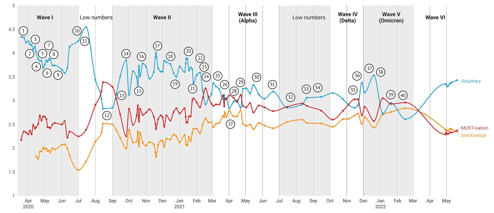

<!-- \fontsize{9}{10} -->
\selectfont

<style type="text/css">
<!-- body{ -->
<!--   font-size: 10pt; -->
<!-- } -->
p.comment {
background-color: #DBDBDB;
padding: 10px;
border: 1px solid black;
margin-left: 25px;
border-radius: 5px;
font-style: italic;
}
div.blue { background-color:#e6f0ff; border-radius: 5px; padding: 20px;}
div.orange { background-color:#ffa366; border-radius: 5px; padding: 20px;}
div.yellow { background-color:#09bb9f; color: white; border-radius: 5px; padding: 20px;}
div.grey { background-color:#ebebeb; border-radius: 5px; padding: 20px;}

</style>

<style>
  .col2 {
    columns: 2 200px;         /* number of columns and width in pixels*/
    -webkit-columns: 2 200px; /* chrome, safari */
    -moz-columns: 2 200px;    /* firefox */
  }
  .col3 {
    columns: 3 100px;
    -webkit-columns: 3 100px;
    -moz-columns: 3 100px;
  }
</style>

<!-- setwd('/Users/joachimwaterschoot/Library/CloudStorage/OneDrive-UGent/watjoa.github.io') -->

<br>

<div class = "row">
<div class = "col-md-8">
<div class = "grey">
**Contact information:**

+	Email: Joachim.waterschoot@ugent.be   
+ Orcid: 0000-0003-0845-9310
+ Address: Department of Developmental, Personality and Social Psychology at the Faculty of Psychology and Educational Sciences, Ghent University, Henri Dunantlaan 2, 9000 Ghent
</div>
</div>
<div class = "col-md-4">

</div>
</div>

My research focuses on **well-being and motivation**, with a broad focus on **_antecedents_** (e.g., emotion regulation strategies, mindfulness), **_intermediate mechanisms_** (e.g., basic psychological needs, motivation, risk perception), and **_outcomes_** (e.g., boredom, vitality, life satisfaction, depression and anxiety symptoms). Within my research, these variables have been approached in the context of several themes, such as educational and health psychology (e.g. COVID-19), but also the proactive nature of human beings. As an important part of this, I have conducted several studies focusing on the question of what **proactive strategies people might use to motivate themselves** during (boring) activities, and how these strategies might differ qualitatively in predicting both subjective (e.g. boredom and effort) and objective outcomes (e.g. performance). This has been tested not only in the laboratory, but also in ecologically valid contexts. 

From the beginning of the COVID-19 crisis, my focus as a PhD researcher shifted towards the crisis. Together with the other members of the team, we started the national research project of the **Motivation Barometer** (which would last for 2.5 years), monitoring the psychological dynamics of the Belgian population, analysing and reporting the results on an ongoing basis, informing policy and society, and writing a number of scientific manuscripts. 

In conducting research, I have a broad fascination with **statistics**. Based on a completed master's degree in statistical data analysis, my overall goal is to address research questions in the most valid and appropriate ways. In particular, I am fascinated by multilevel modelling and different types of cluster analysis, for which I have written R shiny applications and R packages called 'CaviR'. I used this knowledge during the Motivation Barometer project to create a self-written statistical and descriptive dashboard with the most needed information regarding the psychological assessments. I also wrote and designed the website for the project, combining this with graphical visualisations and trying to make the (statistical) information attractive and understandable to the general public. 

<br>

<!-- TO DO'S: -->

<!-- - Mobility: (a) short-term visit or (b) longer-term mobility planned. Goals: to learn -->
<!-- new techniques, transfer knowledge, establish/expand collaborations.   -->
<!-- - Teach a course or mentor students: graduate or undergraduate?   -->
<!-- - Invite and host a collaborator who will give a workshop in your lab.   -->
<!-- - (Co-)organise a scientific meeting   -->
<!-- - Develop a database: specify if it is open-access or restricted   -->
<!-- - Prepare publications in the popular press: name target magazines, radio programmes, etc. Mention relevant past experience.   -->
<!-- - Issue Policy paper: name target organisations, explain what relationships will pave the way for conveying your research findings. -->


# Education <i class="fa fa-graduation-cap" aria-hidden="true"></i>
***

<div class = "row">
<div class = "col-md-2">
*2017 - 2023*
</div>
<div class = "col-md-7">
**PhD candidate in Developmental and Motivational Psychology**  
Thesis: The Motivation Barometer during the COVID-19 crisis in Belgium: The Role of Basic Needs, Risk Perception and Motivation predicting Behavior and Well-Being. (Supervisors: Prof. Maarten Vansteenkiste and Prof. Bart Soenens)
</div>
<div class = "col-md-3">
<i class="fa fa-map-marker" aria-hidden="true"></i> Ghent University Ghent, Belgium.
</div>
</div>

<div class = "row">
<div class = "col-md-2">
*2017 - 2020*
</div>
<div class = "col-md-7">
**MSc in Statistical Data Analysis**  
Thesis: “It is not the quantity of motivation that matters”: a statistical comparison between Cluster analysis and Latent profile analysis (Supervisors: Prof. Jan De Neve and Prof. Wim Beyers)
</div>
<div class = "col-md-3">
<i class="fa fa-map-marker" aria-hidden="true"></i> Ghent University Ghent, Belgium.
</div>
</div>

<div class = "row">
<div class = "col-md-2">
*2012 - 2017*
</div>
<div class = "col-md-7">
**MSc in Experimental and Theoretical Psychology**  
Thesis: Effect of Experimentally Induced Choice on Motivation in Middle Childhood: The Moderating Role of Teacher and Student Characteristics (Supervisor: Prof. Bart Soenens) 
  
Research internship: The Role of Competence-related Attentional Bias and Resilience in Restoring Thwarted Feelings of Competence at the Department of Developmental Psychology, Ghent University (Supervisor: Prof. Maarten Vansteenkiste)
</div>
<div class = "col-md-3">
<i class="fa fa-map-marker" aria-hidden="true"></i> Ghent University Ghent, Belgium.
</div>
</div>

<br> 
<br> 

# Scientific Curriculum <i class="fa fa-clipboard" aria-hidden="true"></i>
***

## Publications {.tabset .tabset-fade .tabset-pills}


<!-- ```{r echo=FALSE, warning=FALSE,message = FALSE} -->
<!-- library(scales) -->
<!-- library(ggplot2) -->
<!-- library(ggthemes) -->
<!-- library(questionr) -->
<!-- blank_theme <- theme_minimal()+ -->
<!--   theme( -->
<!--   axis.title.x = element_blank(), -->
<!--   axis.title.y = element_blank(), -->
<!--   panel.border = element_blank(), -->
<!--   panel.grid=element_blank(), -->
<!--   axis.ticks = element_blank(), -->
<!--   plot.title=element_text(size=14, face="bold") -->
<!--   ) -->

<!-- library(ftExtra) -->
<!-- library(knitr) -->
<!-- library(kableExtra) -->
<!-- Rnew <- readxl::read_excel('/Users/joachimwaterschoot/Library/CloudStorage/OneDrive-UGent/RESEARCH/overview_scientificprojects.xlsx') -->
<!-- library(flextable) -->
<!--   Rnew <- Rnew[-c(1:9),] -->
<!--   Rnew <- Rnew[c(1:which(Rnew$Periode=="CURRENTLY IN THE RUNNING")),c('Reference','Year','Theme','Position')] -->
<!--   Rnew <- Rnew[rowSums(is.na(Rnew)) != ncol(Rnew),] -->
<!--   Rnew$Year <- as.Date(Rnew$Year,format="%Y") -->
<!--   Rnew$Year <- format(Rnew$Year, format="%Y") -->

<!--   Rnew <- as.data.frame(Rnew) -->

<!-- ``` -->


<!-- :::::::::::::: {.columns} -->
<!-- ::: {.column width="50%"} -->

<!-- ```{r echo=FALSE, warning=FALSE,message = FALSE} -->
<!-- theme <- as.data.frame(freq(Rnew$Theme)) -->
<!-- theme$group <- rownames(theme) -->
<!-- theme$value <- theme$`val%` -->
<!-- ggplot(theme, aes(x="", y=value, fill=group))+ -->
<!--   geom_bar(width = 1, stat = "identity")+ coord_polar("y", start=0)+ -->
<!--   scale_fill_brewer(palette="Blues")+ -->
<!--   blank_theme+ -->
<!--   theme(axis.text.x=element_blank(),legend.position="top") + -->
<!--   geom_text(aes(x =  1.2,label = percent(value/100)),  -->
<!--             position = position_stack(vjust = 0.5)) -->
<!-- ``` -->

<!-- ::: -->

<!-- ::: {.column width="50%"} -->

<!-- ```{r echo=FALSE, warning=FALSE,message = FALSE} -->
<!-- Rnew$pos_cat <- c() -->
<!-- Rnew$Position <- as.numeric(Rnew$Position) -->
<!-- Rnew[which(Rnew$Position==1),'pos_cat'] <- "1" -->
<!-- Rnew[which(Rnew$Position==2),'pos_cat'] <- "2" -->
<!-- Rnew[which(Rnew$Position>2),'pos_cat'] <- 'co-author' -->

<!-- theme <- as.data.frame(freq(Rnew$pos_cat)) -->
<!-- theme$group <- rownames(theme) -->
<!-- theme$value <- theme$`val%` -->
<!-- ggplot(theme, aes(x="", y=value, fill=group))+ -->
<!--   geom_bar(width = 1, stat = "identity")+ coord_polar("y", start=0)+ -->
<!--   scale_fill_brewer(palette="Blues")+ -->
<!--   blank_theme+ -->
<!--   theme(axis.text.x=element_blank(),legend.position="top") + -->
<!--   geom_text(aes(x =  1.2,label = percent(value/100)),  -->
<!--             position = position_stack(vjust = 0.5)) -->
<!-- ``` -->

<!-- ::: -->
<!-- :::::::::::::: -->

<!-- <br>  -->

### By year

#### 2024

```{r echo=FALSE, warning=FALSE,message = FALSE}
library(ftExtra)
library(knitr)
library(kableExtra)
library(lubridate)
Rnew <- readxl::read_excel('/Users/joachimwaterschoot/Library/CloudStorage/OneDrive-UGent/RESEARCH/overview_scientificprojects.xlsx')
library(flextable)
  Rnew <- Rnew[-c(1:9),]
  Rnew <- Rnew[c(1:which(Rnew$Periode=="CURRENTLY IN THE RUNNING")),c('Reference','Year','Theme')]
  Rnew <- Rnew[rowSums(is.na(Rnew)) != ncol(Rnew),]
  Rnew$Year <- format(Rnew$Year, format="%Y")
  
  Rnew <- as.data.frame(Rnew)
  Rnew <- Rnew[order(Rnew$Year,decreasing=TRUE),]
  Rnew$numb <- paste(dim(Rnew)[1]:1,'. ',sep="")
  Rnew$Reference <- paste(Rnew$numb,Rnew$Reference,sep="")
  Rnew <- Rnew[,c('Reference','Year','Theme')]
  row.names(Rnew) <- NULL
  
  Rnewh <- as.data.frame(Rnew[which(Rnew$Year=="2024"),c('Reference')])

  kable(Rnewh, format = "html",escape=FALSE,row.names = F,booktabs = T,col.names = NULL)
```

<br>

#### 2023

```{r echo=FALSE, warning=FALSE,message = FALSE}
Rnewh <- as.data.frame(Rnew[which(Rnew$Year=="2023"),c('Reference')])

  kable(Rnewh, format = "html",escape=FALSE,row.names = F,booktabs = T,col.names = NULL)
```

<br>

#### 2022

```{r echo=FALSE, warning=FALSE,message = FALSE}
Rnewh <- as.data.frame(Rnew[which(Rnew$Year=="2022"),c('Reference')])

  kable(Rnewh, format = "html",escape=FALSE,row.names = F,booktabs = T,col.names = NULL)
```

<br>

#### 2021

```{r echo=FALSE, warning=FALSE,message = FALSE}
Rnewh <- as.data.frame(Rnew[which(Rnew$Year=="2021"),c('Reference')])

 kable(Rnewh, format = "html",escape=FALSE,row.names = F,booktabs = T,col.names = NULL)
```

<br>

#### 2020

```{r echo=FALSE, warning=FALSE,message = FALSE}
Rnewh <- as.data.frame(Rnew[which(Rnew$Year=="2020"),c('Reference')])

 kable(Rnewh, format = "html",escape=FALSE,row.names = F,booktabs = T,col.names = NULL)
```

<br>

#### 2019

```{r echo=FALSE, warning=FALSE,message = FALSE}
Rnewh <- as.data.frame(Rnew[which(Rnew$Year=="2019"),c('Reference')])

 kable(Rnewh, format = "html",escape=FALSE,row.names = F,booktabs = T,col.names = NULL)
```

<br>

### By theme

```{r echo=FALSE, warning=FALSE,message = FALSE}
library(ftExtra)
Rnew <- readxl::read_excel('/Users/joachimwaterschoot/Library/CloudStorage/OneDrive-UGent/RESEARCH/overview_scientificprojects.xlsx')
library(flextable)
  Rnew <- Rnew[-c(1:9),]
  Rnew <- Rnew[c(1:which(Rnew$Periode=="CURRENTLY IN THE RUNNING")),c('Reference','Theme','Year')]
  Rnew <- Rnew[rowSums(is.na(Rnew)) != ncol(Rnew),]
  Rnew$Year <- format(Rnew$Year, format="%Y")
  
  Rnew <- as.data.frame(Rnew)
  Rnew <- Rnew[order(Rnew$Year,decreasing=TRUE),]
  Rnew$numb <- paste(dim(Rnew)[1]:1,'. ',sep="")
  Rnew$Reference <- paste(Rnew$numb,Rnew$Reference,sep="")

  Rnewh <- Rnew #[which(Rnew$Theme=="covid19"),]

  Rnewh <- Rnewh[,c('Theme','Reference')]
  Rnewh <- Rnewh[order(Rnewh$Theme),]
  
   kable(Rnewh, format = "html",escape=FALSE,row.names = F,booktabs = T,col.names = NULL)

```

<br>

### By position

#### First author

```{r echo=FALSE, warning=FALSE,message = FALSE}
library(ftExtra)
Rnew <- readxl::read_excel('/Users/joachimwaterschoot/Library/CloudStorage/OneDrive-UGent/RESEARCH/overview_scientificprojects.xlsx')
library(flextable)
  Rnew <- Rnew[-c(1:9),]
  Rnew <- Rnew[c(1:which(Rnew$Periode=="CURRENTLY IN THE RUNNING")),c('Reference','Year','Position')]
  Rnew <- Rnew[rowSums(is.na(Rnew)) != ncol(Rnew),]
  Rnew$Year <- format(Rnew$Year, format="%Y")
  

  Rnew <- as.data.frame(Rnew)
  Rnew <- Rnew[order(Rnew$Position,decreasing=FALSE),]
  Rnew <- Rnew[order(Rnew$Year,decreasing=TRUE),]
  Rnew$Position <- as.numeric(Rnew$Position)
  Rnewh <- Rnew[which(Rnew$Position==1),]
  Rnewh$numb <- paste(dim(Rnewh)[1]:1,'. ',sep="")
  Rnewh$Reference <- paste(Rnewh$numb,Rnewh$Reference,sep="")
  Rnewh <- Rnewh[,c('Reference','Year')]
  
  kable(Rnewh, format = "html",escape=FALSE,row.names = F,booktabs = T,col.names = NULL)

```

<br>

#### Second author

```{r echo=FALSE, warning=FALSE,message = FALSE}
library(ftExtra)
Rnew <- readxl::read_excel('/Users/joachimwaterschoot/Library/CloudStorage/OneDrive-UGent/RESEARCH/overview_scientificprojects.xlsx')
library(flextable)
  Rnew <- Rnew[-c(1:9),]
  Rnew <- Rnew[c(1:which(Rnew$Periode=="CURRENTLY IN THE RUNNING")),c('Reference','Year','Position')]
  Rnew <- Rnew[rowSums(is.na(Rnew)) != ncol(Rnew),]
  Rnew$Year <- format(Rnew$Year, format="%Y")
  

  Rnew <- as.data.frame(Rnew)
  Rnew <- Rnew[order(Rnew$Position,decreasing=FALSE),]
  Rnew <- Rnew[order(Rnew$Year,decreasing=TRUE),]
  Rnew$Position <- as.numeric(Rnew$Position)
  Rnewh <- Rnew[which(Rnew$Position==2),]
  Rnewh$numb <- paste(dim(Rnewh)[1]:1,'. ',sep="")
  Rnewh$Reference <- paste(Rnewh$numb,Rnewh$Reference,sep="")
  Rnewh <- Rnewh[,c('Reference','Year')]
  
  kable(Rnewh, format = "html",escape=FALSE,row.names = F,booktabs = T,col.names = NULL)

```

<br>

#### Co-author

```{r echo=FALSE, warning=FALSE,message = FALSE}
library(ftExtra)
Rnew <- readxl::read_excel('/Users/joachimwaterschoot/Library/CloudStorage/OneDrive-UGent/RESEARCH/overview_scientificprojects.xlsx')
library(flextable)
  Rnew <- Rnew[-c(1:9),]
  Rnew <- Rnew[c(1:which(Rnew$Periode=="CURRENTLY IN THE RUNNING")),c('Reference','Year','Position')]
  Rnew <- Rnew[rowSums(is.na(Rnew)) != ncol(Rnew),]
  Rnew$Year <- format(Rnew$Year, format="%Y")
  

  Rnew <- as.data.frame(Rnew)
  Rnew <- Rnew[order(Rnew$Position,decreasing=FALSE),]
  Rnew <- Rnew[order(Rnew$Year,decreasing=TRUE),]
  Rnew$Position <- as.numeric(Rnew$Position)
  Rnewh <- Rnew[which(Rnew$Position>2),]
  Rnewh$numb <- paste(dim(Rnewh)[1]:1,'. ',sep="")
  Rnewh$Reference <- paste(Rnewh$numb,Rnewh$Reference,sep="")
  Rnewh <- Rnewh[,c('Reference','Year','Position')]
  
  kable(Rnewh, format = "html",escape=FALSE,row.names = F,booktabs = T,col.names = NULL)

```

<br>

### Projects going on

#### In Review

```{r echo=FALSE, warning=FALSE,message = FALSE}
library(ftExtra)
Rnew <- readxl::read_excel('/Users/joachimwaterschoot/Library/CloudStorage/OneDrive-UGent/RESEARCH/overview_scientificprojects.xlsx')
library(flextable)
  Rnew <- Rnew[-c(1:9),]
  Rnew <- Rnew[c(which(Rnew$Periode=="CURRENTLY IN THE RUNNING"):which(Rnew$Periode=="OPEN IDEAS")),c('Reference','Status','Position')]

  Rnew <- as.data.frame(Rnew)
  Rnew <- Rnew[!is.na(Rnew$Reference),]
  Rnew <- Rnew[which(Rnew$Status=="in review"),]
  Rnew$numb <- paste(dim(Rnew)[1]:1,'. ',sep="")
  Rnew$ref <- paste(Rnew$numb,Rnew$Reference)
  Rnew <- Rnew[,c('ref')]
  
  kable(Rnew, format = "html",escape=FALSE,row.names = F,booktabs = T,col.names = NULL)

```

<br>

#### Submitted

```{r echo=FALSE, warning=FALSE,message = FALSE}
library(ftExtra)
Rnew <- readxl::read_excel('/Users/joachimwaterschoot/Library/CloudStorage/OneDrive-UGent/RESEARCH/overview_scientificprojects.xlsx')
library(flextable)
  Rnew <- Rnew[-c(1:9),]
  Rnew <- Rnew[c(which(Rnew$Periode=="CURRENTLY IN THE RUNNING"):which(Rnew$Periode=="OPEN IDEAS")),c('Reference','Status','Position')]

  Rnew <- as.data.frame(Rnew)
  Rnew <- Rnew[!is.na(Rnew$Reference),]
  Rnew <- Rnew[which(Rnew$Status=="Submitted"),]
  Rnew$numb <- paste(dim(Rnew)[1]:1,'. ',sep="")
  Rnew$ref <- paste(Rnew$numb,Rnew$Reference)
  Rnew <- Rnew[,c('ref')]
  
  kable(Rnew, format = "html",escape=FALSE,row.names = F,booktabs = T,col.names = NULL)

```

<br>

#### In progress

```{r echo=FALSE, warning=FALSE,message = FALSE}
library(ftExtra)
Rnew <- readxl::read_excel('/Users/joachimwaterschoot/Library/CloudStorage/OneDrive-UGent/RESEARCH/overview_scientificprojects.xlsx')
library(flextable)
  Rnew <- Rnew[-c(1:9),]
  Rnew <- Rnew[c(which(Rnew$Periode=="CURRENTLY IN THE RUNNING"):which(Rnew$Periode=="OPEN IDEAS")),c('Reference','Status','Position')]

  Rnew <- as.data.frame(Rnew)
  Rnew <- Rnew[!is.na(Rnew$Reference),]
  Rnew <- Rnew[which(Rnew$Status=="in progress"),]
  Rnew$numb <- paste(dim(Rnew)[1]:1,'. ',sep="")
  Rnew$ref <- paste(Rnew$numb,Rnew$Reference)
  Rnew <- Rnew[,c('ref')]
  
  kable(Rnew, format = "html",escape=FALSE,row.names = F,booktabs = T,col.names = NULL)

```

<br>

## Conferences

#### 2024

```{r echo=FALSE, warning=FALSE,message = FALSE}
library(ftExtra)
Rnew <- readxl::read_excel('/Users/joachimwaterschoot/Library/CloudStorage/OneDrive-UGent/RESEARCH/overview_scientificprojects.xlsx')
library(flextable)
  Rnew <- Rnew[-c(1:9),]
  Rnew <- Rnew[c(which(Rnew$Periode=="CONFERENCES"):(which(Rnew$Periode=="REVIEWS")-1)),c('Reference','Year','Theme')]
  Rnew <- Rnew[rowSums(is.na(Rnew)) != ncol(Rnew),]
  Rnew$Year <- format(Rnew$Year, format="%Y")
  

  Rnew <- as.data.frame(Rnew)
  Rnew <- Rnew[order(Rnew$Year,decreasing=TRUE),]
  Rnew$numb <- paste(dim(Rnew)[1]:1,'. ',sep="")
  Rnew$Reference <- paste(Rnew$numb,Rnew$Reference,sep="")
  Rnew <- Rnew[,c('Reference','Year')]

   Rnewh <- as.data.frame(Rnew[which(Rnew$Year=="2024"),c('Reference')])


  kable(Rnewh, format = "html",escape=FALSE,row.names = F,booktabs = T,col.names = NULL)
```

<br>


#### 2023

```{r echo=FALSE, warning=FALSE,message = FALSE}

  Rnewh <- as.data.frame(Rnew[which(Rnew$Year=="2023"),c('Reference')])


  kable(Rnewh, format = "html",escape=FALSE,row.names = F,booktabs = T,col.names = NULL)
```

<br>

#### 2022

```{r echo=FALSE, warning=FALSE,message = FALSE}

  Rnewh <- as.data.frame(Rnew[which(Rnew$Year=="2022"),c('Reference')])


  kable(Rnewh, format = "html",escape=FALSE,row.names = F,booktabs = T,col.names = NULL)
```

<br>

#### 2019

```{r echo=FALSE, warning=FALSE,message = FALSE}

  Rnewh <- as.data.frame(Rnew[which(Rnew$Year=="2019"),c('Reference')])


  kable(Rnewh, format = "html",escape=FALSE,row.names = F,booktabs = T,col.names = NULL)
```

<br> 

#### 2018

```{r echo=FALSE, warning=FALSE,message = FALSE}

  Rnewh <- as.data.frame(Rnew[which(Rnew$Year=="2018"),c('Reference')])


  kable(Rnewh, format = "html",escape=FALSE,row.names = F,booktabs = T,col.names = NULL)
```

<br> 

<!-- ## Reviewer -->

<!-- ```{r echo=FALSE, warning=FALSE,message = FALSE} -->
<!-- library(ftExtra) -->
<!-- Rnew <- readxl::read_excel('/Users/joachimwaterschoot/Library/CloudStorage/OneDrive-UGent/RESEARCH/overview_scientificprojects.xlsx') -->
<!-- library(flextable) -->
<!--   Rnew <- Rnew[-c(1:9),] -->
<!--   Rnew <- Rnew[c(which(Rnew$Periode=="REVIEWS"):(which(Rnew$Periode=="END")-1)),c('Reference','Year')] -->
<!--   Rnew <- Rnew[rowSums(is.na(Rnew)) != ncol(Rnew),] -->
<!--   Rnew$Year <- as.Date(Rnew$Year,format="%Y") -->
<!--   Rnew$Year <- format(Rnew$Year, format="%Y") -->

<!--   Rnew <- as.data.frame(Rnew) -->
<!--   Rnew <- Rnew[order(Rnew$Year,decreasing=TRUE),] -->
<!--   Rnew$numb <- paste(dim(Rnew)[1]:1,'. ',sep="") -->
<!--   Rnew$Reference <- paste(Rnew$numb,Rnew$Reference,sep="") -->
<!--   Rnew <- Rnew[,c('Reference','Year')] -->

<!--   Rnewh <- as.data.frame(Rnew[,c('Reference','Year')]) -->

<!--   kable(Rnewh, format = "html",escape=FALSE,row.names = F,booktabs = T,col.names = NULL) -->
<!-- ``` -->

<!-- <br> -->

## Public reports

#### 2023

```{r echo=FALSE, warning=FALSE,message = FALSE}
library(ftExtra)
Rnew <- readxl::read_excel('/Users/joachimwaterschoot/Library/CloudStorage/OneDrive-UGent/RESEARCH/overview_scientificprojects.xlsx')
library(flextable)
  Rnew <- Rnew[-c(1:9),]
  Rnew <- Rnew[c(which(Rnew$Periode=="PUBLIC REPORTS"):(which(Rnew$Periode=="LEZINGEN")-1)),c('Reference','Year','Theme')]
  Rnew <- Rnew[rowSums(is.na(Rnew)) != ncol(Rnew),]
  Rnew$Year <- format(Rnew$Year, format="%Y")
  

  Rnew <- as.data.frame(Rnew)
  Rnew <- Rnew[order(Rnew$Year,decreasing=TRUE),]
  Rnew$numb <- paste(dim(Rnew)[1]:1,'. ',sep="")
  Rnew$Reference <- paste(Rnew$numb,Rnew$Reference,sep="")
  Rnew <- Rnew[,c('Reference','Year')]

   Rnewh <- as.data.frame(Rnew[which(Rnew$Year=="2023"),c('Reference')])


  kable(Rnewh, format = "html",escape=FALSE,row.names = F,booktabs = T,col.names = NULL)
```

<br>

<center>
*Overview of motivation across the COVID-19 pandemic in Belgium with published reports.*

</center>

<br>

#### 2022

```{r echo=FALSE, warning=FALSE,message = FALSE}

  Rnewh <- as.data.frame(Rnew[which(Rnew$Year=="2022"),c('Reference')])


  kable(Rnewh, format = "html",escape=FALSE,row.names = F,booktabs = T,col.names = NULL)
```

<br>

#### 2021

```{r echo=FALSE, warning=FALSE,message = FALSE}

  Rnewh <- as.data.frame(Rnew[which(Rnew$Year=="2021"),c('Reference')])


  kable(Rnewh, format = "html",escape=FALSE,row.names = F,booktabs = T,col.names = NULL)
```

<br>

#### 2020

```{r echo=FALSE, warning=FALSE,message = FALSE}

  Rnewh <- as.data.frame(Rnew[which(Rnew$Year=="2020"),c('Reference')])


  kable(Rnewh, format = "html",escape=FALSE,row.names = F,booktabs = T,col.names = NULL)
```

<br>

## Insights 

```{r echo=FALSE, warning=FALSE,message = FALSE}
library(dplyr)
library(ggplot2)
library(scholar)
#library(easyPubMed)
library(questionr)
library(ggthemes)
library(tidyverse)
library(plotly)
library(ggplotlyExtra)

id <- "F-fOgBoAAAAJ"

pub <- get_publications(id)

# hindex <- predict_h_index(id)
# hindex$years_ahead <- hindex$years_ahead+as.numeric(format(Sys.time(),"%Y"))
# hindexplot <- ggplot(hindex, aes(years_ahead, h_index)) + 
#   geom_line(col='blue')+
#   geom_point()+
#   theme_few()+labs(title="Predicted h-index")+
#    scale_x_continuous(breaks=seq(as.numeric(format(Sys.time(),"%Y")),
#                                  max(hindex$years_ahead),
#                                  by = 1))
# ggplotly(hindexplot)

citations <- get_citation_history(id)
citplot <- ggplot(citations, aes(year, cites)) + 
  geom_line(col='blue')+
  geom_point()+
  theme_few()+labs(title="Citations by year")

andi_id <- id
pubs <- get_publications(andi_id)
current_year <- as.numeric(format(Sys.Date(), "%Y"))
all_cites <- map_dfr(pubs$pubid,
                       ~ get_article_cite_history(andi_id, .x))
red_pubs <- pubs |>
  mutate(paper_year = year,
         total_cites = cites) |>
  select(title, author, paper_year, journal, pubid, total_cites)
all_cites_pub <- all_cites |>
  left_join(red_pubs)
complete_paper_cites <- function(one_paper) {
  expand_years <- setdiff(unique(one_paper$paper_year):current_year,
                          one_paper$year)
  complete(one_paper,
           year = expand_years,
           cites = 0,
           pubid,
           title,
           author,
           paper_year,
           journal,
           total_cites) |>
    arrange(year)  
} 
all_cites_filled <- all_cites_pub |>
  group_split(pubid) |>
  map_dfr(complete_paper_cites) |>
  mutate(age = year - paper_year)
all_cites_cum <- all_cites_filled |>
  group_by(pubid) |>
  mutate(cum_sum = cumsum(cites))

plotall <- all_cites_cum |>
  ggplot(aes(x = year, y = cum_sum, 
             colour = reorder(str_trunc(title, 20), desc(total_cites)))) +
  geom_line(linewidth = 1, alpha = 0.5) +
  theme(legend.position = "none") +
  labs(x = "Year",
       y = "Cumulative citations",
       colour = "Paper",
       title = "All the papers")+theme_few()
ggplotly(plotall)


```

:::::::::::::: {.columns}
::: {.column width="50%"}

```{r echo=FALSE, warning=FALSE,message = FALSE}


citplot

min_cites <- 40
to_plot <- all_cites_cum |>
  filter(total_cites >= min_cites)
atleast<- to_plot |>
  ggplot(aes(x = year,
             y = cum_sum,
             colour = reorder(str_trunc(title, 20), desc(total_cites)))) +
  geom_line(size=1)+
  theme(legend.position = "right",
        legend.directio = "vertical") +
  labs(x = "Year",
       y = "Cumulative citations",
       colour = "Paper",
       title = paste("Papers cited at least", min_cites, "times")) +
  scale_x_continuous(breaks = seq(min(to_plot$year),max(to_plot$year)+2, 2)) +
  scale_y_continuous(breaks = seq(0,ceiling(max(to_plot$cum_sum)/200)*200, 200))+theme_few()


to_plot <- all_cites_cum |>
  filter(total_cites >= min_cites)

atleastall <- to_plot |>
  filter(age >= 0 & cum_sum > 0) |>
  ggplot(aes(x = age,
             y = cum_sum,
             colour = reorder(str_trunc(title, 20), desc(total_cites)))) +
  geom_line(size=1)+
  #stat_smooth(geom="line", linewidth = 1) +
  theme(legend.position = "right",
        legend.directio = "vertical") +
  labs(x = "Age (years)",
       y = "Cumulative citations",
       colour = "Paper",
       title = paste("Papers cited at least", min_cites, "times")) +
  scale_x_continuous(breaks = seq(min(to_plot$age),max(to_plot$age)+2, 1)) +
  scale_y_continuous(trans = "log2")+theme_few()
```

:::
::: {.column width="50%"}

```{r echo=FALSE, warning=FALSE,message = FALSE}
atleastall

```

:::
::::::::::::::

<br>


# Teaching <i class="fa fa-users" aria-hidden="true"></i>
***

## Experience

<div class = "row">
<div class = "col-md-2">
*2020 - current*
</div>
<div class = "col-md-7">
**Motivation Psychology**: Lecture on Interest Theory and co-lecturer since 2023
Educational Master
</div>
<div class = "col-md-3">
<i class="fa fa-map-marker" aria-hidden="true"></i> Ghent University Ghent, Belgium.
</div>
</div>

<div class = "row">
<div class = "col-md-2">
*2017 - current*
</div>
<div class = "col-md-7">
**Academic Skills**: Supervision, teaching and evaluation of the courses
2nd Bachelor, Psychology
</div>
<div class = "col-md-3">
<i class="fa fa-map-marker" aria-hidden="true"></i> Ghent University Ghent, Belgium.
</div>
</div>

<div class = "row">
<div class = "col-md-2">
*2017 - current*
</div>
<div class = "col-md-7">
**Psychology of the Lifespan**: assigments evaluation of the course
3d Bachelor, Psychology
</div>
<div class = "col-md-3">
<i class="fa fa-map-marker" aria-hidden="true"></i> Ghent University Ghent, Belgium.
</div>
</div>

<div class = "row">
<div class = "col-md-2">
*2019 - current*
</div>
<div class = "col-md-7">
**Developmental Psychology**: supervision, organizing, teaching and evaluating of practical sessions and examination of the course.
1st Bachelor, Psychology and 2nd Bachelor, Educational Sciences
</div>
<div class = "col-md-3">
<i class="fa fa-map-marker" aria-hidden="true"></i> Ghent University Ghent, Belgium.
</div>
</div>

<div class = "row">
<div class = "col-md-2">
*2017 - 2018*
</div>
<div class = "col-md-7">
**Recent Theories on Developmental Psychology**: supervision, organizing, teaching and evaluating of practical sessions and examination of the course.
2nd Bachelor, Psychology
</div>
<div class = "col-md-3">
<i class="fa fa-map-marker" aria-hidden="true"></i> Ghent University Ghent, Belgium.
</div>
</div>

## Lectures

```{r echo=FALSE, warning=FALSE,message = FALSE}
library(ftExtra)
Rnew <- readxl::read_excel('/Users/joachimwaterschoot/Library/CloudStorage/OneDrive-UGent/RESEARCH/overview_scientificprojects.xlsx')
library(flextable)
  Rnew <- Rnew[-c(1:9),]
  Rnew <- Rnew[c(which(Rnew$Periode=="LEZINGEN"):(which(Rnew$Periode=="CONFERENCES")-1)),c('Reference','Year')]
  Rnew <- Rnew[rowSums(is.na(Rnew)) != ncol(Rnew),]
  Rnew$Year <- format(Rnew$Year, format="%Y")
  

  Rnew <- as.data.frame(Rnew)
  Rnew <- Rnew[order(Rnew$Year,decreasing=TRUE),]
  Rnew$numb <- paste(dim(Rnew)[1]:1,'. ',sep="")
  Rnew$Reference <- paste(Rnew$numb,Rnew$Reference,sep="")
  Rnew <- Rnew[,c('Reference')]

  kable(Rnew, format = "html",escape=FALSE,row.names = F,booktabs = T, col.names = NULL)

```


<br>
<br>

## Master theses supervision

```{r echo=FALSE, warning=FALSE,message = FALSE}
library(ftExtra)
Rnew <- readxl::read_excel('/Users/joachimwaterschoot/Library/CloudStorage/OneDrive-UGent/RESEARCH/overview_scientificprojects.xlsx')
library(flextable)
  Rnew <- Rnew[c(which(Rnew$Periode=="MASTER THESES"):(which(Rnew$Periode=="PUBLIC REPORTS")-1)),c('Reference','Theme')]
  Rnew <- Rnew[rowSums(is.na(Rnew)) != ncol(Rnew),]

   Rnew$numb <- paste(dim(Rnew)[1]:1,'. ',sep="")
  Rnew$Reference <- paste(Rnew$numb,Rnew$Reference,sep="")
  Rnew <- Rnew[,c('Reference','Theme')]
  Rnew <- as.data.frame(Rnew)
  
  kable(Rnew, format = "html",escape=FALSE,row.names = F,booktabs = T,col.names = NULL)
```

<br>
<br>

# Media & Podcasts <i class="fa fa-newspaper-o" aria-hidden="true"></i>
***

<div class = "row">
<div class = "col-md-2">
*02/08/2022*
</div>
<div class = "col-md-7">

80-plussers zijn al aan vijfde vaccinprik toe

</div>
<div class = "col-md-3">

[DS <i class="fa fa-file-pdf-o" aria-hidden="true"></i>](download/press/covid/destand80.pdf)
</div>
</div>

<div class = "row">
<div class = "col-md-2">
*23/06/2022*
</div>
<div class = "col-md-7">

Podcast 'Motivationbarometer', episode: Risk perception

</div>
<div class = "col-md-3">
[Spotify <i class="fa fa-spotify" aria-hidden="true"></i>](https://open.spotify.com/episode/2GjCmZTxjONfmgYBNhPNJu?si=7d5da8bf43104ce5)
</div>
</div>


<div class = "row">
<div class = "col-md-2">
*06/05/2021*
</div>
<div class = "col-md-7">

Ruim zeven op de tien studenten willen vaccin

</div>
<div class = "col-md-3">
[DM <i class="fa fa-file-pdf-o" aria-hidden="true"></i>](download/press/covid/20210506Ruim-zeven-op-de-tien-studenten-willen-vaccin.pdf)
</div>
</div>


<div class = "row">
<div class = "col-md-2">
*18/06/2020*
</div>
<div class = "col-md-7">

“Al zevenduizend wandelaars voor 100 km Covid Challenge”

</div>
<div class = "col-md-3">
[Nieuwsblad <i class="fa fa-file-pdf-o" aria-hidden="true"></i>](download/press/covid/20200618zevenduizend-wandelaars-voor-100-km-Covid-Cha.pdf)
</div>
</div>

<div class = "row">
<div class = "col-md-2">
*20/05/2020*
</div>
<div class = "col-md-7">

De quarantaineparadox: hoe corona ons tijdsbesef verandert

</div>
<div class = "col-md-3">
[Knack <i class="fa fa-file-pdf-o" aria-hidden="true"></i>](download/press/covid/20200520knack.pdf)
</div>
</div>

<div class = "row">
<div class = "col-md-2">
*28/04/2020*
</div>
<div class = "col-md-7">

Coronavirus - Psychologen: "motivatiecampagne is cruciaal om deze volksmarathon vol te houden"

</div>
<div class = "col-md-3">
[Belga <i class="fa fa-file-pdf-o" aria-hidden="true"></i>](download/press/covid/20200428volksmarathon-vol-t.pdf)
</div>
</div>


<div class = "row">
<div class = "col-md-2">
*06/03/2020*
</div>
<div class = "col-md-7">

Universiteit Gent doet onderzoek naar deelname aan de Dodentocht

</div>
<div class = "col-md-3">

[GVA <i class="fa fa-file-pdf-o" aria-hidden="true"></i>](download/press/dodentocht/download-clip_20200306_gazet-van-antwerpen-mechelen-waas_p-22-23.pdf) <br>
[HLN (1) <i class="fa fa-file-pdf-o" aria-hidden="true"></i>](download/press/dodentocht/20200306_Het-Laatste-Nieuws_p-0_Dodentocht-Goesting-zorgt-voor-betere-motivatie-dan-druk.pdf) <br>
[HLN (2) <i class="fa fa-file-pdf-o" aria-hidden="true"></i>](download/press/dodentocht/download-clip_20200307_het-laatste-nieuws-mechelen-lier_p-40-41.pdf) <br>
[VRT <i class="fa fa-file-pdf-o" aria-hidden="true"></i>](download/press/dodentocht/vrt_be.pdf) <br>
[RTV <i class="fa fa-video-camera" aria-hidden="true"></i>](download/press/dodentocht/rtv_be.pdf) <br>
[Radio 1 <i class="fa fa-microphone" aria-hidden="true"></i>](download/press/dodentocht/Radio1_06032020.mp4) <br>
[Radio 2 Antw <i class="fa fa-microphone" aria-hidden="true"></i>](download/press/dodentocht/Radio2_Antwerpen_06032020.aac) <br>
[Radio 2 O-Vl <i class="fa fa-microphone" aria-hidden="true"></i>](download/press/dodentocht/Radio2_OVL_06032020.aac) <br>
[Joe FM <i class="fa fa-microphone" aria-hidden="true"></i>](download/press/dodentocht/JoeFM_06032020.aac)
</div>
</div>

# Software <i class="fa fa-code" aria-hidden="true"></i>
***

<div class = "row">
<div class = "col-md-8">

Development of R package **CaviR** including functions to both calculate and visualize statistical functions, like MANOVA, regression tables and interaction figures.
<br>
All information can be found [here...](https://cavir-statistics.com/)


</div>
<div class = "col-md-4">
<center>

</center>
</div>
</div>

<br>

# Awards <i class="fa fa-trophy" aria-hidden="true"></i>
***

<div class = "blue">
<div class = "row">
<div class = "col-md-8">

**October 21, 2021**


The 'Royal Flemish Academy of Belgium' (KVAB) and the 'Young Academy' annually hand out the **'Distinctions for Scientific Communication'** to scientists with an exceptional merit in scientific communication. The Year Prizes are awarded to researchers who have devoted themselves intensively over the past two years to a concrete project in the field of science communication.

Text on the website: *Maarten Vansteenkiste, Joachim Waterschoot and Sofie Morbée are awarded the Annual Scientific Communication Prize for their communication on the motivation barometer in the context of the coronapandemic. The motivation barometer has gradually developed into an important policy instrument. There is also strong appreciation for the accompanying excellent website on which the findings are disseminated to a very wide audience through dozens of accessible reports, opinion pieces and media interventions, and which provides an insight into the scientific process.*

[Watch... <i class="fa fa-youtube-play" aria-hidden="true"></i>](https://www.youtube.com/watch?v=Q_h7re70y_U&feature=emb_title)
<br>
[Read more...](https://kvab.be/nl/prijzen/jaarprijzen-wetenschapscommunicatie)

</div>
<div class = "col-md-4">
<center>

</center>
</div>

</div>
</div>

<br>
<br>

# Research visits <i class="fa fa-globe" aria-hidden="true"></i>
***


<div class = "row">
<div class = "col-md-4">
<div class = "blue">

<br>
<br>
**Invited research visit** <br>
*November 18 - 24, 2022*

<i class="fa fa-map-marker" aria-hidden="true"></i> NTNY, Trondheim, Norway 🇳🇴 <br>
<i class="fa fa-users" aria-hidden="true"></i> Invitation from Prof. Dr. Jolene Van der Kaap-Deeder to teach and to support the research group in data analysis of different research projects, doing this in R.
<br>
[Link to research group](https://kvab.be/nl/prijzen/jaarprijzen-wetenschapscommunicatie)

</div>
</div>

<div class = "col-md-4">
<div class = "blue">

<br>
<br>
**Research visit** <br>
*April 11 - July 5, 2024*

<i class="fa fa-map-marker" aria-hidden="true"></i> Institute for Positive Psychology and Education, Australian Catholic University, Sydney, Australia 🇦🇺 <br>
<i class="fa fa-users" aria-hidden="true"></i> Invitation from Prof. Dr. Richard Ryan to visit the Insitute for Positive Psychology and Education team, next to Prof. Dr. JohnMarshal Reeve and Prof. Dr. Emma Bradshaw
<br>
[Link to research group](https://www.acu.edu.au/research-and-enterprise/our-research-institutes/institute-for-positive-psychology-and-education/about-us)

</div>
</div>

</div>

<br>

# Extracurricular activities
***

**2023**

- Organization of **scientific day** for +300 attendees with international speakers like Ryan, Mageau, etc. ('Strengthening young people's resilience together: The motivational role of teachers, parents and caregivers', website: https://www.studiedag-veerkracht.be/). July 7, 2023, Faculty of Psychology and Educational Science, Ghent, Belgium. 

**2021 – current**

-	**Alumni functioning**: GAP (member of steering group: secretary and co-director since 2023)  
-	**Representative for pre- and post-docs**: Department meeting, Faculty Board, Commission of Scientific Research

**2019– current**

-	Organization of **IPSAS** meetings on department (Informal Presentations for Starters And Seniors): once each 6 months (from 2019 on) with invited speakers and workshops (e.g., scientific poster construction). 

**2017– current**

-	**Alumni functioning**: GAP (member of steering group: secretary)  
-	**Representative for pre- and post-docs**: Department meeting  

**2015 – 2017**

-	**Alumni functioning**: GAP (voluntarily member)  
-	**Student council** of the Faculty of Psychology and Educational Sciences (PPSR): President, Member of GSR (General Student Representation), Commission of Reception, Commission of Finance and Staff, Commission of Scientific Research, Faculty Board, Commission of the Course of Education Psychology

<br> 
<br> 
